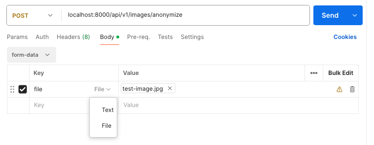

### COSC428 Computer Vision project

## Image anonymiser for faces and vehicle licence plates

To run the demo:

* Ensure you have Python >= 3.12.4 installed
* Ensure you have Poetry >= 1.8.2 installed
* Run `poetry install` to install depenencies
* You will need pre-trained model weights for the two detection models. Place these in a `models` directory in the project root. They should be called `yolov11l-face.pt` and `licence_plate_detector.pt`.
* The face model weights used for the project can be found at https://huggingface.co/AlekseyKorshuk/yolov11-face/tree/main
* The licence plate model weights used for the project can be found at https://github.com/bhaskrr/number-plate-recognition-using-yolov11/tree/main
* Create a local folder of test images (png, jpg or jpeg)
* Run the demo with `poetry run demo --directory=<your_local_image_dir>`

## Run the API with Docker

1. You will need pre-trained model weights for the two detection models. Place these in a `models` directory in the project root. They should be called `yolov11l-face.pt` and `licence_plate_detector.pt`. Make sure these are in place before building the docker image.

2. Build the Docker image:
   ```bash
   docker build -t anonymiser-api .
   ```
This can take a while. Go make a cuppa while you wait :coffee:

2. Run the container:
   ```bash
   docker run -p 8000:8000 anonymiser-api
   ```

The API will be available at `http://localhost:8000/api/v1/images/anonymize`

To test the API with `cUrl`:
```bash
curl -X POST -F "file=@/path/to/your/image.jpg" http://localhost:8000/api/v1/images/anonymize --output anonymised.jpg
```

To test from Postman, specify the body as form-data and ensure the value type is set to 'File'.



## Run in Google Colab

You can use the file [COSC428_project_test.ipynb](https://githubtocolab.com/tineke-corin/project_428/blob/main/COSC428_project_test.ipynb) to run a pipeline speed test on various runtimes in Google Colab.

Note that after cloning the github repository, you will need to add a 'models' directory underneath 'project_428' and upload `license_plate_detector.pt` and `yolov11l-face.pt` to that directory. These files can be downloaded from the links mentioned earlier in this document.

## License

This project is licensed under the **GNU Affero General Public License v3.0 (AGPL-3.0)**. 

This project incorporates [Ultralytics YOLOv11](https://github.com/ultralytics/ultralytics), which is also licensed under AGPL-3.0. In accordance with the terms of this license:
* The complete source code for this project, including any modifications, training scripts, and inference code, is made publicly available.
* If you use this software to provide a service over a network, you must make the source code available to your users.
* For commercial use cases that require a proprietary, closed-source codebase, please contact [Ultralytics licensing](https://www.ultralytics.com/license) for an Enterprise License.

See the [LICENSE](LICENSE) file for the full text of the AGPL-3.0 license.

## References

Jocher, G., & Qiu, J. (2024). Ultralytics YOLO11 (Version 11.0.0) [Computer software]. https://github.com/ultralytics/ultralytics

```bibtex
@software{yolo11_ultralytics,
  author = {Glenn Jocher and Jing Qiu},
  title = {Ultralytics YOLO11},
  version = {11.0.0},
  year = {2024},
  url = {https://github.com/ultralytics/ultralytics},
  orcid = {0000-0001-5950-6979, 0000-0003-3783-7069},
  license = {AGPL-3.0}
}
